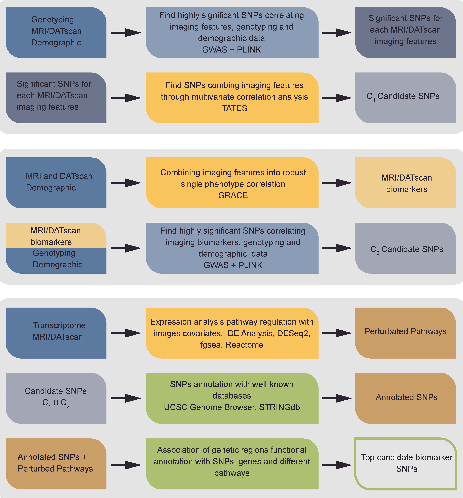

# MUVIG: MUlti View on Imagin Genetics

Imaging genetics workflow to find Parkinson's Disease potential genetic biomarkers, combining genetics, transcriptomics and imaging data. Above is presented the workflow of this project.



## Overview

The data analyzed comes from the Parkinson’s Progression Marker Initiative (PPMI: [link](https://www.ppmi-info.org)). It contains the most complete and comprehensive collection of PD-related data. PPMI aims to identify new potential biomarkers of progression for PD through longitudinal studies, which use and correlate data from different sources, in order to enhance the development of new therapies and treatments. PPMI is sponsored by the Michael J. Fox Foundation for Parkinson’s Research, and gathers a huge amount of imaging, genetic and neurobehavioral data collected by many research centers in North America, Europe, Israel and Australia. Among the available genetic data in PPMI, genotyping and transcriptomic data provide a comprehensive perspective of which roles play in PD genetic variation, genes expression and gene-gene interactions.

## Data

To test this workflow we used genetic (genotyping and transcriptomic) and imaging data (DaTscan and MRI) avaiable at PPMI data portal.

* **Genotyping data** consists of a set of DNA sequence polymorphism (SNPs and indels), available in two datasets: ImmunoChip and NeuroX. Both of them are in the plink binary format
*  **Transcriptmoic data** consists of different counts data per patients (.txt file)
*  **Imaging data** consists of two set of different images: DaTscan measured the amount of dopamine transporter in four regions of the brain striatum (right/left caudate and putamen), and MRI, containing the morphological information of each brain region. Both of these file are in the csv format. The file related to the DaTscan data is just avaiable from PPMI. The MRI was produced after processing the imaging avaiable. 

## Contents

The content of this repository reflects the workflow. The files are dividev into 4 main folders:

* Preprocessing
* Individual View
* Integrated View
* Functional Interpretation

## Usage

The project was developed using python inside jupyter notebook. For the generation of the quantile-quanitile and the Manhattan plots was used R lunched inside the notebook as well. The third part related to the Functional Interpretation step was totally engineered using R.

## Installation

In order to run correctly the complete workflow you need to install the followin programs:

### **PLINK**

PLINK is avaialble at [PLINK download](https://zzz.bwh.harvard.edu/plink/download.shtml). Are avaiable ZIP files containing binaries compilied on various platforms as well as the C/C++ source code. Linux/Unix users should download the source code and compile. The downloads also contain a version of gPLINK, an (optional) GUI for PLINK. PLINK is available as a Debian package

### The following **R packages**:

```R
BiocManager::install(c("magrittr","clusterProfiler","Homo.sapiens","AnnotationDbi","EnsDb.Hsapiens.v75","fgsea","BiocParallel"))
install.packages(c("qqman","RNOmni","edgeR","variancePartition","tidyverse","devtools","ggplot2","MKmisc"))
install_bitbucket("mdonohue/grace")
```
### The following **Python modules**:

```bash
pip install scipy.stats matplotlib_venn pandas matplotlib.pyplot seaborn math
```

### The following **tools**:

* **Tates**: avaiable at [Tates download](https://ctg.cncr.nl/software/tates)
* **Grace**: avaiable at [Grace download](https://bitbucket.org/mdonohue/grace/src/master/)

## Input example

To run the first two step of the analysis (Individual View and Functional Interpretation), we passaed as input 2 files in PLINK binary format, regarding two different microarray chip.
For each file, in PLINK binary formay, you would have 3 different files:

* **.bim** (PLINK extended MAP file)
* **.bed** (PLINK binary biallelic genotype table)
* **.fam** (PLINK sample information file)

For the third phase (Functional Interpretation) regarding the RNA-Seq analysis as input were used different counts file(simply the number of reads overlapping a given gene), joined together in the RNASeq.R file.

## Contributing
Pull requests are welcome. For major changes, please open an issue first to discuss what you would like to change.

Please make sure to update tests as appropriate.

## Support

You can contact directly the authors by their e-mail addresses.

## Authors and acknowledgment

Guglielmo Cerri (cerriguglielmo@gmail.com) and Manuel Tognon(manuel.tognon@univr.it) created the workflow. Thanks also to Alessia Leanza that created the workflow image.

## License
[MIT](https://choosealicense.com/licenses/mit/)
